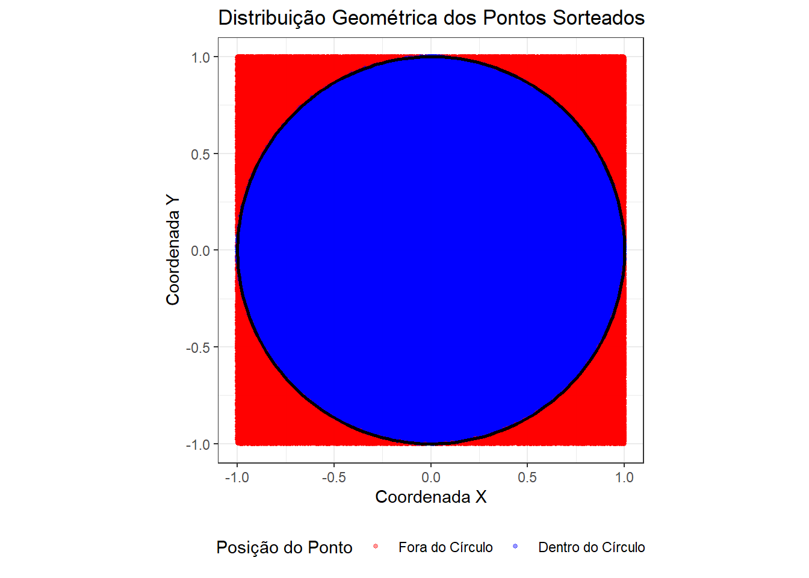
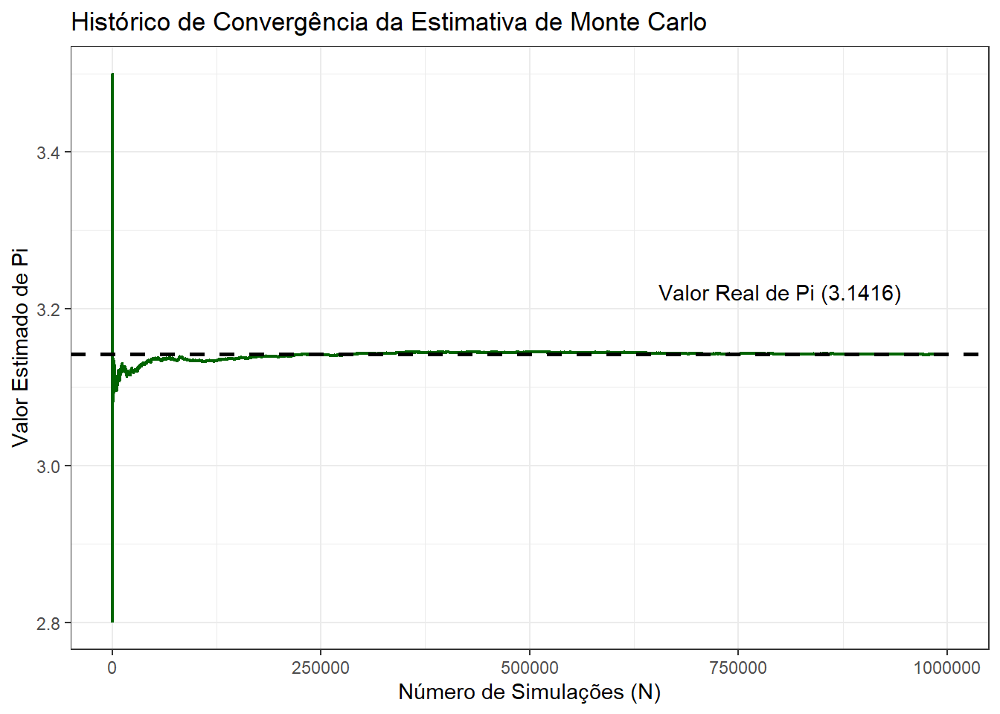
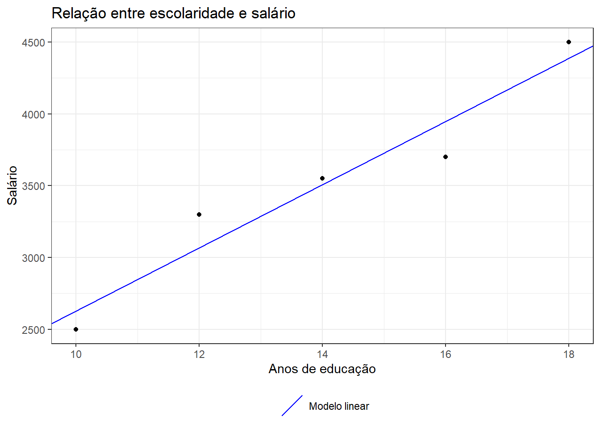

# Fluxos de execução

## Estruturas condicionais

O fluxo de código em R pode ser controlado por meio de estruturas condicionais, como o `if`, `else if` e `else`. Essas estruturas permitem que você execute diferentes blocos de código com base em condições específicas.

### `if` e `else`

O `if` é uma estrutura de controle de fluxo que executa um bloco de código se uma condição especificada for verdadeira. Se a condição for falsa, o bloco de código dentro do if não será executado. Por outro lado, o `else` é usado para executar um bloco de código quando a condição do if for falsa.

A sintaxe básica do `if` e `else` em R é a seguinte:


::: {.cell}

```{.r .cell-code}
if (condição) {
  # Bloco de código a ser executado se a condição for verdadeira
} else {
  # Bloco de código a ser executado se a condição for falsa
}
```
:::


Aqui está um exemplo prático de como usar o `if` e `else` para verificar se um número inteiro escolhido aleatóriamente entre -10 e 10 é positivo ou negativo:


::: {.cell}

```{.r .cell-code}
# Definindo a semente para garantir reprodutibilidade
set.seed(42)

# Gerando um número aleatório entre -10 e 10
numero <- sample(-10:10, 1)

if (numero > 0) {
  print("O número é positivo.")
} else {
  print("O número é negativo ou zero.")
}
```

::: {.cell-output .cell-output-stdout}

```
[1] "O número é positivo."
```


:::
:::


Neste exemplo, `sample(-10:10, 1)` gera um número aleatório entre -10 e 10, e o valor é atribuído à variável numero. Além disso, `set.seed(123)` define a semente como 123. Isso garante que, ao gerar o número aleatório com `sample()`, o mesmo número seja escolhido sempre que o código for executado. Em seguida, verificamos se o número é positivo ou não e imprimimos a mensagem correspondente.

### `else if`

Além do `if` e `else`, também podemos usar o `else if` para adicionar mais condições à estrutura condicional. O `else if` permite verificar múltiplas condições em sequência. Se a condição do `if` for falsa, ele verifica a próxima condição do `else if`. Se todas as condições do `if` e `else if` forem falsas, o bloco de código dentro do `else` é executado.

Aqui está a sintaxe do else if:


::: {.cell}

```{.r .cell-code}
if (condição1) {
  # Bloco de código a ser executado se a condição1 for verdadeira
} else if (condição2) {
  # Bloco de código a ser executado se a condição2 for verdadeira
} else {
  # Bloco de código a ser executado se nenhuma das condições anteriores for verdadeira
}
```
:::


Veja um exemplo prático de como usar o if, else if e else para avaliar o desempenho de uma empresa com base em sua receita anual:


::: {.cell}

```{.r .cell-code}
# Determina a classificação da empresa com base na receita anual
receita_anual <- 1500000

if (receita_anual >= 2000000) {
  print("Empresa de Grande Porte")
} else if (receita_anual >= 1000000) {
  print("Empresa de Médio Porte")
} else if (receita_anual >= 500000) {
  print("Empresa de Pequeno Porte")
} else {
  print("Microempresa")
}
```

::: {.cell-output .cell-output-stdout}

```
[1] "Empresa de Médio Porte"
```


:::
:::


Neste exemplo, a empresa é classificada com base em sua receita anual. Se a receita for igual ou superior a 2.000.000, a empresa será classificada como "Empresa de Grande Porte". Se estiver entre 1.000.000 e 1.999.999, será classificada como "Empresa de Médio Porte". Se estiver entre 500.000 e 999.999, será classificada como "Empresa de Pequeno Porte". Caso contrário, será considerada uma "Microempresa".

## Estruturas de repetição

As estruturas de repetição, também conhecidas como loops, são utilizadas para executar um bloco de código repetidamente enquanto uma condição específica for verdadeira ou para percorrer uma sequência de elementos. Isso é útil quando você precisa executar uma tarefa várias vezes ou quando deseja iterar sobre uma coleção de dados.

### `for` {#sec-fluxos-for}

Uma das estruturas de repetição mais comuns é o loop `for.` O loop for é usado para iterar sobre uma sequência de valores, como uma sequência numérica de números inteiros ou os elementos de um vetor.

Existem duas maneiras de se usar o `for` loop.

-   Usando for para iterar sobre índices:


::: {.cell}

```{.r .cell-code}
# Exemplo de loop for para iterar sobre índices
for (i in 1:5) {
  print(i)
}
```

::: {.cell-output .cell-output-stdout}

```
[1] 1
[1] 2
[1] 3
[1] 4
[1] 5
```


:::
:::


Neste exemplo, o loop `for` itera sobre os valores de 1 a 5. Na primeira iteração, `i` é igual a 1; na segunda iteração, `i` é igual a 2; e assim por diante, até que `i` seja igual a 5.

-   Usando for para iterar sobre elementos:


::: {.cell}

```{.r .cell-code}
# Exemplo de loop for para iterar sobre elementos de um vetor
clientes <- c("João", "Maria", "José", "Ana")
for (nome in clientes) {
  print(nome)
}
```

::: {.cell-output .cell-output-stdout}

```
[1] "João"
[1] "Maria"
[1] "José"
[1] "Ana"
```


:::
:::


Neste exemplo acima, o loop for itera sobre os elementos do vetor `clientes`. Na primeira iteração, nome é igual a "João"; na segunda iteração, `nome` é igual a "Maria"; e assim por diante, até que todos os elementos do vetor sejam percorridos.

Em ambos os exemplos, o bloco de código dentro do loop `for` é executado repetidamente para cada valor de `i` (no primeiro exemplo) ou `nome` (no segundo exemplo) até que a sequência seja completamente percorrida.

No exemplo abaixo, vamos simular dados econômicos para 10 países fictícios e calcular o PIB per capita de cada país.


::: {.cell}

```{.r .cell-code}
set.seed(42)
pib_paises <- runif(10, min = 25000000, max = 40000000)
populacao_paises <- runif(10, min = 1000000, max = 15000000)

pib_per_capita <- numeric(length = 10)

# Loop for para calcular o PIB per capita para cada pais
for (i in 1:10) {
  # Calculando o PIB per capita
  pib_per_capita[i] <- pib_paises[i] / populacao_paises[i]
}
print(round(pib_per_capita, 3))
```

::: {.cell-output .cell-output-stdout}

```
 [1]  5.227  3.529  2.080  8.185  4.634  2.315  2.453 10.216  4.556  4.022
```


:::
:::


::: {.callout-tip collapse="true" title="Clique e veja um exemplo extra"}
Imagine que temos uma série temporal representando o preço de fechamento diário de uma ação ao longo de um período de 30 dias. Queremos calcular a média móvel de 5 dias desse preço, ou seja, para cada dia, queremos calcular a média dos preços de fechamento dos cinco dias anteriores, incluindo o dia atual.

Primeiro, vamos simular os dados do preço de fechamento diário da ação:


::: {.cell}

```{.r .cell-code}
set.seed(42)
preco_acao <- runif(30, min = 9, max = 15)
```
:::


Agora, vamos calcular a média móvel de 5 dias usando um loop `for`:


::: {.cell}

```{.r .cell-code}
media_movel <- numeric(length = 26)  # Vetor para armazenar a média móvel

for (i in 5:30) {
  media_movel[i - 4] <- mean(preco_acao[(i - 4):i])
}
```
:::


Neste loop for, começamos a partir do quinto dia, pois precisamos de pelo menos cinco dias para calcular a média móvel de 5 dias. Para cada dia a partir do quinto dia até o trigésimo dia, calculamos a média dos preços de fechamento dos cinco dias anteriores, incluindo o dia atual, e armazenamos esse valor no vetor media_movel.

Agora, podemos imprimir a média móvel calculada:


::: {.cell}

```{.r .cell-code}
print(media_movel)
```

::: {.cell-output .cell-output-stdout}

```
 [1] 13.33226 12.85740 12.61682 12.43505 12.22691 12.30289 12.22926 12.20829
 [9] 13.16830 12.68642 12.39510 12.97382 13.28476 12.30414 12.56762 12.68527
[17] 12.64209 11.63467 12.68036 13.24636 12.67289 12.20510 12.50690 12.40711
[25] 11.80747 12.71175
```


:::
:::


Este exemplo demonstra como usar um loop for em conjunto com vetores para calcular a média móvel de uma série temporal. O gráfico abaixo mostra a média móvel ao longo dos dias.


::: {.cell}
::: {.cell-output-display}
{width=672}
:::
:::


::: callout-note
Você vai aprender a construir gráficos como este no [Capítulo 4](04-visualizacao.qmd).
:::
:::

### `while`

A estrutura `while` é usada para repetir um bloco de código enquanto uma condição especificada for verdadeira. Aqui está a estrutura geral de um loop while:


::: {.cell}

```{.r .cell-code}
while (condição) {
  # Código a ser repetido enquanto a condição for verdadeira
}
```
:::


A condição é uma expressão lógica que é avaliada antes de cada execução do bloco de código dentro do loop. Se a condição for verdadeira, o bloco de código é executado; se a condição for falsa, o loop é interrompido e o controle é passado para a próxima linha de código após o loop.

No exemplo abaixo, vamos definir um vetor chamado `acoes`, que contém uma lista de atividades possíveis que uma pessoa pode realizar durante o dia. Dentre as ações possíveis, uma será escolhida aleatoriamente.


::: {.cell}

```{.r .cell-code}
acoes <- c( "Aprender a programar em R",
        "Aprender a programar em Python",
        "Fazer um café",
        "Descansar")

set.seed(42)
acao <- sample(acoes, 1)
print(acao)
```

::: {.cell-output .cell-output-stdout}

```
[1] "Aprender a programar em R"
```


:::
:::


No trecho de código a seguir, usamos a estrutura `while` para continuar selecionando aleatoriamente uma atividade do vetor `acoes` até que a atividade selecionada seja "Descansar". O loop começa verificando se a variável `acao` é diferente de "Descansar". Se essa condição for verdadeira, uma nova atividade é selecionada aleatoriamente do vetor acoes usando a função `sample()` com `size = 1`, o que significa que estamos selecionando apenas um elemento aleatório do vetor. Em seguida, a atividade selecionada é impressa na tela usando a função `print()`. Esse processo se repete até que a atividade selecionada seja "Descansar", momento em que o loop é encerrado.


::: {.cell}

```{.r .cell-code}
set.seed(420)
while(acao != "Descansar") {
  acao <- sample(acoes, 1)
  print(acao)
}
```

::: {.cell-output .cell-output-stdout}

```
[1] "Aprender a programar em R"
[1] "Aprender a programar em R"
[1] "Aprender a programar em Python"
[1] "Aprender a programar em Python"
[1] "Descansar"
```


:::
:::


::: {.callout-tip collapse="true" title="Clique e veja um exemplo extra"}
Vamos considerar um exemplo onde queremos simular a evolução de uma população ao longo do tempo, onde não sabemos exatamente quantos períodos serão necessários para que a população atinja um determinado limite. Neste caso, usaremos um loop `while` para continuar simulando o crescimento populacional até que a população alcance um certo valor limite.


::: {.cell}

```{.r .cell-code}
set.seed(42)  # Define uma semente para a replicabilidade dos resultados

# População inicial
populacao <- 1000

# Taxa de crescimento anual da população (em decimal)
taxa_crescimento <- 0.02

# População limite desejada
limite_populacional <- 2000

# Inicializando o contador de anos
anos <- 0

# Simulando o crescimento populacional até atingir o limite
while (populacao < limite_populacional) {
  # Calculando o número de novos indivíduos neste ano
  novos_individuos <- populacao * taxa_crescimento
  
  # Incrementando a população com os novos indivíduos
  populacao <- populacao + novos_individuos
  
  # Incrementando o contador de anos
  anos <- anos + 1
}

# Imprimindo o número de anos necessários para atingir o limite populacional
print(paste("Foram necessários", anos, "anos para atingir uma população de", populacao))
```

::: {.cell-output .cell-output-stdout}

```
[1] "Foram necessários 36 anos para atingir uma população de 2039.8873437157"
```


:::
:::


::: callout-note
É possível calcular diretamente o número de anos necessários para atingir a população limite desejada. Com um pouco de álgebra você chege na seguinte fórmula para calcular o número de anos: $$\text{anos} = \frac{\log\left(\frac{\text{limite\_populacional}}{\text{populacao\_inicial}}\right)}{\log(1 + \text{taxa\_crescimento})}.$$
:::
:::

### Exemplos com Simulação de Monte Carlo

A Simulação de Monte Carlo é um método computacional que utiliza a amostragem aleatória repetida para obter resultados numéricos aproximados para problemas que podem ser determinísticos ou estocásticos. Em economia e finanças, essa técnica é amplamente utilizada quando uma solução analítica exata é difícil ou impossível de ser calculada, permitindo simular milhares de cenários possíveis para avaliar riscos, prever comportamentos de mercado ou aproximar integrais complexas.

A estrutura básica de uma simulação de Monte Carlo envolve:
1. Definir o modelo matemático ou processo estocástico do sistema.
2. Gerar uma grande quantidade de insumos aleatórios a partir de distribuições de probabilidade conhecidas.
3. Computar o resultado de interesse para cada cenário.
4. Agregar os resultados individuais (geralmente por meio da média) para obter a estimativa final.

<!-- **Exemplo 1: Estimando o valor de $\pi$ (Abordagem Geométrica)** -->

<!-- O exemplo clássico de Monte Carlo consiste em aproximar o valor de $\pi$ utilizando geometria e probabilidade. Imagine um quadrado de lado $2$ centrado na origem, cuja área é $2 \times 2 = 4$. Dentro dele, inscrevemos um círculo de raio $r = 1$, cuja área é $\pi r^2 = \pi$. -->

<!-- Se sortearmos pontos aleatórios uniformemente dentro desse quadrado, a probabilidade $p$ de um ponto cair dentro do círculo é a razão entre as áreas: -->

<!-- $$p = \frac{\text{Área do Círculo}}{\text{Área do Quadrado}} = \frac{\pi}{4}$$ -->

<!-- Portanto, podemos aproximar $\pi$ simulando $N$ pontos $(x, y)$, onde $x, y \in [-1, 1]$, contando quantos pontos satisfazem a condição do círculo ($x^2 + y^2 \leq 1$) e isolando o $\pi$: -->

<!-- $$\pi \approx 4 \times \frac{\text{Pontos dentro do círculo}}{\text{Total de pontos } (N)}$$ -->

<!-- Veja como implementar essa simulação em R utilizando um loop `for` e uma estrutura condicional `if`: -->

<!-- ```{r} -->
<!-- # Definindo a semente para reprodutibilidade -->
<!-- set.seed(42) -->

<!-- # Número de replicações (iterações) -->
<!-- n_simulacoes <- 100000 -->

<!-- # Contador para os pontos que caem dentro do círculo -->
<!-- pontos_dentro <- 0 -->

<!-- for (i in 1:n_simulacoes) { -->
<!--   # Sorteando coordenadas x e y entre -1 e 1 -->
<!--   x <- runif(1, min = -1, max = 1) -->
<!--   y <- runif(1, min = -1, max = 1) -->

<!--   # Verificando se o ponto está dentro do círculo de raio 1 -->
<!--   if ((x^2 + y^2) <= 1) { -->
<!--     pontos_dentro <- pontos_dentro + 1 -->
<!--   } -->
<!-- } -->

<!-- # Estimando o valor de Pi -->
<!-- pi_estimado <- 4 * (pontos_dentro / n_simulacoes) -->

<!-- print(paste("Valor estimado de Pi:", pi_estimado)) -->
<!-- print(paste("Erro absoluto:", abs(pi - pi_estimado))) -->
<!-- ``` -->

**Exemplo Prático: Estimando o valor de $\pi$ (Abordagem Geométrica e Convergência)**

O exemplo clássico de Monte Carlo consiste em aproximar o valor de $\pi$ utilizando geometria e probabilidade. Imagine um quadrado de lado $2$ centrado na origem, cuja área é $2 \times 2 = 4$. Dentro dele, inscrevemos um círculo de raio $r = 1$, cuja área é $\pi r^2 = \pi$.

Se sortearmos pontos aleatórios uniformemente dentro desse quadrado, a probabilidade $p$ de um ponto cair dentro do círculo é a razão entre as áreas:

$$p = \frac{\text{Área do Círculo}}{\text{Área do Quadrado}} = \frac{\pi}{4}$$

Portanto, podemos aproximar $\pi$ simulando $N$ pontos $(x, y)$, onde $x, y \in [-1, 1]$, contando quantos pontos satisfazem a condição do círculo ($x^2 + y^2 \leq 1$) e isolando o $\pi$:

$$\pi \approx 4 \times \frac{\text{Pontos dentro do círculo}}{\text{Total de pontos } (N)}$$

Para visualizar a Lei dos Grandes Números em ação, vamos salvar o histórico das estimativas ao longo das iterações para observar a convergência do valor estimado em direção ao valor real de $\pi$ à medida que $N$ cresce até $10.000$.


::: {.cell}

```{.r .cell-code}
# Definindo a semente para reprodutibilidade
set.seed(42)

# Número de replicações (iterações)
n_simulacoes <- 1000000

# Vetores para armazenar o histórico da simulação
historico_x <- numeric(length = n_simulacoes)
historico_y <- numeric(length = n_simulacoes)
dentro_circulo <- logical(length = n_simulacoes)
historico_pi <- numeric(length = n_simulacoes)

pontos_dentro <- 0

for (i in 1:n_simulacoes) {
  # Sorteando coordenadas x e y entre -1 e 1
  historico_x[i] <- runif(1, min = -1, max = 1)
  historico_y[i] <- runif(1, min = -1, max = 1)
  
  # Verificando se o ponto está dentro do círculo de raio 1
  if ((historico_x[i]^2 + historico_y[i]^2) <= 1) {
    pontos_dentro <- pontos_dentro + 1
    dentro_circulo[i] <- TRUE
  } else {
    dentro_circulo[i] <- FALSE
  }
  
  # Salvando a estimativa parcial de Pi até a iteração atual
  historico_pi[i] <- 4 * (pontos_dentro / i)
}

# Exibindo o resultado final da última iteração
print(paste("Valor final estimado de Pi para N = 10000:", historico_pi[n_simulacoes]))
```

::: {.cell-output .cell-output-stdout}

```
[1] "Valor final estimado de Pi para N = 10000: 3.141648"
```


:::
:::


Abaixo, podemos visualizar graficamente o comportamento dos pontos sorteados no plano cartesiano e, em seguida, o processo de convergência da estimativa ao longo das $10.000$ repetições.


::: {.cell}
::: {.cell-output-display}
{width=672}
:::
:::


::: {.cell}
::: {.cell-output-display}
{width=672}
:::
:::


::: callout-note
Note como, no início da simulação (valores baixos de $N$), a estimativa oscila de forma agressiva. À medida que o número de pontos simulados se aproxima de $10.000$, a linha verde estabiliza e converge em torno da linha tracejada, que representa o valor real de $\pi$. Você vai aprender a construir e personalizar gráficos usando o pacote `ggplot2` no [Capítulo 4](04-visualizacao.qmd).
:::

**Exemplo Prático: Precificação de Opções Financeiras (Call Européia)**

No contexto financeiro, os métodos de Monte Carlo são fundamentais para precificar derivativos complexos. Vamos considerar o caso de uma **Opção de Compra Europeia (European Call Option)**. 

Uma opção de compra dá ao investidor o direito (mas não a obrigação) de comprar uma ação em uma data futura específica (Data de Vencimento $T$) por um preço previamente combinado (Preço de Exercício ou *Strike Price* $K$).

* Se na data $T$ o preço da ação ($S_T$) for maior que $K$, o investidor exerce a opção, compra por $K$, vende a mercado por $S_T$ e obtém um ganho (*payoff*) de $S_T - K$.
* Se $S_T$ for menor ou igual a $K$, a opção perde a validade e o ganho é zero.
* Logo, o ganho da opção no vencimento é dado por: $\max(S_T - K, 0)$.

Para encontrar o preço justo da opção hoje ($t=0$), precisamos projetar o preço futuro da ação sob o cenário neutro ao risco, calcular a média dos *payoffs* simulados e trazê-la a valor presente descontando pela taxa de juros livre de risco ($r$).

O modelo padrão de Black-Scholes assume que o preço da ação segue um **Movimento Browniano Geométrico**. A equação que dita o preço do ativo no vencimento $T$ a partir do preço inicial $S_0$ é:

$$S_T = S_0 \exp\left( \left(r - \frac{\sigma^2}{2}\right)T + \sigma \sqrt{T} Z \right)$$

Onde:

* $S_0$: Preço atual da ação.
* $r$: Taxa de juros livre de risco anualizada.
* $\sigma$: Volatilidade anualizada do preço da ação (grau de incerteza).
* $T$: Tempo até o vencimento em anos.
* $Z$: Uma variável aleatória Normal Padrão, ou seja, $Z \sim N(0, 1)$.

Abaixo, simulamos 50.000 caminhos possíveis para o preço final da ação para precificar uma opção:


::: {.cell}

```{.r .cell-code}
set.seed(42)

# Parâmetros da Opção e do Ativo
S0 <- 100        # Preço inicial da ação
K  <- 105        # Preço de exercício (Strike)
r  <- 0.05       # Taxa de juros livre de risco (5% ao ano)
sigma <- 0.20    # Volatilidade do ativo (20% ao ano)
T_anos <- 1      # Tempo até o vencimento (1 ano)

# Parâmetros da Simulação
n_trajetorias <- 50000
soma_payoffs <- 0

for (i in 1:n_trajetorias) {
  # Geração do choque aleatório Z ~ N(0,1)
  Z <- rnorm(1, mean = 0, sd = 1)
  
  # Projeção do preço da ação no vencimento T usando a equação do modelo
  ST <- S0 * exp((r - (sigma^2) / 2) * T_anos + sigma * sqrt(T_anos) * Z)
  
  # Cálculo do payoff da opção de compra (Call)
  payoff <- max(ST - K, 0)
  
  # Acumulando os payoffs
  soma_payoffs <- soma_payoffs + payoff
}

# Média dos payoffs simulados
media_payoff <- soma_payoffs / n_trajetorias

# Trazendo o valor médio esperado para o valor presente (desconto estocástico)
preco_opcao_mc <- exp(-r * T_anos) * media_payoff

print(paste("Preço estimado da Opção via Monte Carlo: R$", round(preco_opcao_mc, 2)))
```

::: {.cell-output .cell-output-stdout}

```
[1] "Preço estimado da Opção via Monte Carlo: R$ 8.04"
```


:::
:::


Neste exemplo, cada iteração do loop gera uma trajetória independente para o preço final da ação no vencimento. Ao final, a média de todos os cenários possíveis fornece uma aproximação robusta do preço justo do derivativo sob as premissas adotadas.


## Funções {#sec-fluxos-funcoes}

Uma função em R é um bloco de código que realiza uma tarefa específica e pode ser reutilizado várias vezes. A sintaxe para definir uma função em R segue o padrão:


::: {.cell}

```{.r .cell-code}
nome_da_funcao <- function(parametros) {
  # Corpo da função
  # Código que realiza a tarefa desejada
  # Pode incluir operações matemáticas, manipulação de dados, etc.
  return(resultado)  # Retorna o resultado desejado
}
```
:::


Os parâmetros são variáveis que uma função recebe como entrada para executar suas operações. Eles são especificados entre parênteses na definição da função. Dentro do corpo da função, os parâmetros podem ser utilizados para realizar cálculos ou operações.

O exemplo abaixo define uma função para realizar uma regressão linear simples. A função `regressao_linear` recebe dois parâmetros: `x` e `y`, que representam os dados de entrada para a regressão linear. Dentro da função, um modelo de regressão linear é criado usando a função `lm()` do R com os dados `y` em função de `x`. A documentação da função `lm()` pode ser acessada ao executar o comando `?lm`. O modelo resultante é retornado como resultado da função.


::: {.cell}

```{.r .cell-code}
# Função para realizar regressão linear simples
regressao_linear <- function(x, y) {
  modelo <- lm(y ~ x)  # Criando o modelo de regressão linear
  return(modelo)  # Retornando o modelo
}

# Dados de exemplo: salário (y) em função dos anos de educação (x)
anos_educacao <- c(10, 12, 14, 16, 18)
salario <- c(2500, 3300, 3550, 3700, 4500)

# Chamando a função de regressão linear
modelo_regressao <- regressao_linear(anos_educacao, salario)
```
:::


Veja o sumário com o resultado do modelo treinado.


::: {.cell}

```{.r .cell-code}
# Exibindo os resultados da regressão
summary(modelo_regressao)
```

::: {.cell-output .cell-output-stdout}

```

Call:
lm(formula = y ~ x)

Residuals:
   1    2    3    4    5 
-130  230   40 -250  110 

Coefficients:
            Estimate Std. Error t value Pr(>|t|)   
(Intercept)   430.00     498.20   0.863  0.45156   
x             220.00      34.88   6.307  0.00805 **
---
Signif. codes:  0 '***' 0.001 '**' 0.01 '*' 0.05 '.' 0.1 ' ' 1

Residual standard error: 220.6 on 3 degrees of freedom
Multiple R-squared:  0.9299,	Adjusted R-squared:  0.9065 
F-statistic: 39.78 on 1 and 3 DF,  p-value: 0.008054
```


:::
:::


A figura abaixo mostra um gráfico de dispersão que representa a relação entre anos de educação e salário. A reta azul mostra o modelo de regressão linear treinado com os dados.


::: {.cell}
::: {.cell-output-display}
{width=672}
:::
:::


::: callout-note
Você vai aprender a construir gráficos como este no [Capítulo 4](04-visualizacao.qmd).
:::

## Pacotes {#sec-pacotes}

Os pacotes no R são conjuntos de funções, conjuntos de dados e documentação que ampliam as capacidades básicas da linguagem R. Eles são essenciais para expandir a funcionalidade do R, permitindo que os usuários realizem uma ampla variedade de tarefas.

Os pacotes do R estão disponíveis no CRAN (Comprehensive R Archive Network), um repositório centralizado que abriga uma vasta coleção de pacotes, manuais, documentações e outros recursos relacionados ao R. O CRAN é essencialmente o principal hub para distribuição de pacotes R e serve como uma fonte confiável e abrangente de ferramentas para análise de dados, estatísticas e muito mais. Para acessar os pacotes do CRAN, você pode usar a função `install.packages()`. Por exemplo:


::: {.cell}

```{.r .cell-code}
install.packages("nome_do_pacote")
```
:::


Depois de instalar um pacote, você precisa carregá-lo em sua sessão R usando a função `library()`:


::: {.cell}

```{.r .cell-code}
library(nome_do_pacote)
```
:::


Isso tornará as funções e conjuntos de dados do pacote disponíveis para uso em sua sessão atual.

## Exercícios

**1.** Neste exercício, vamos simular o lançamento de uma moeda e armazenar os resultados como um fator contendo os níveis "cara" e "coroa". Para isso, siga os passos abaixo:

**a)** Utilize o comando abaixo para gerar amostras aleatórias seguindo a distribuição binomial para simular o lançamento de 100 moedas:


::: {.cell}

```{.r .cell-code}
set.seed(42)
lancamentos <- rbinom(100, 1, 0.5)
```
:::


**b)** Considere que 0 represente "cara" e 1 represente "coroa". Crie uma variável para armazenar os lançamentos como um fator contendo os níveis "cara" e "coroa".

**c)** Conte quantas vezes cada um dos resultados ocorreu neste experimento.

**d)** Utilize um loop para percorrer o vetor de traz para frente e descubra qual foi o último lançamento que resultado em uma "cara".

**2.** Trabalhando com dados de pacotes.

**a)** Instale o pacote `nycflights13` utilizando o comando abaixo:


::: {.cell}

```{.r .cell-code}
install.packages("nycflights13")
```
:::


**b)** Carregue no seu ambiente o pacote instalado:


::: {.cell}

```{.r .cell-code}
library(nycflights13)
```
:::


**c)** Utilizando os comandos abaixo, verifique o conteúdo dos dataframes `flights` e `airports`:


::: {.cell}

```{.r .cell-code}
?flights
?airports
```
:::


**d)** Filtre os voos que aconteceram em 25/01/2013 e armazene-os na variável natal;

**e)** Quantos voos partiram de Nova Iorque em 25/12/2013?

**f)** Obtenha um sumário da coluna dep_delay. Há dados faltantes? Se sim, remova-os.

**g)** Obtenha o nome do aeroporto de destino do voo com maior atraso de partida em 25/12/2013. Dica: mescle os dados de `flights` e `airports`.

